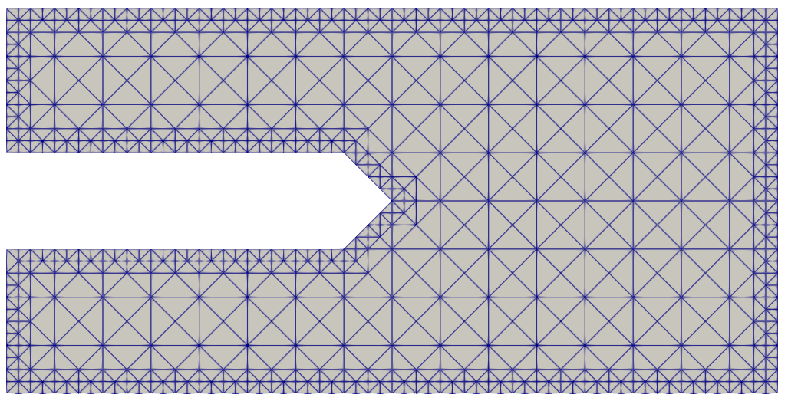

# FiniteElementAndQuasicontinuumFracture

This is a MATLAB implementation of fundamental static/dynamic 2D/3D linear-elastic/neo-Hookean-hyperelastic finite element method (FEM).

Additionally, this repository also attempts to reproduce the following models:

1. A tension-compression-asymmetry neo-Hookean model: [1] Zhang, Gang, et al. "Fracture in tension–compression-asymmetry solids via phase field modeling." Computer Methods in Applied Mechanics and Engineering 357 (2019): 112573.

2. Quasicontinuum (QC) algorithm in: [2] Ghareeb, Ahmed, and Ahmed Elbanna. "An adaptive quasicontinuum approach for modeling fracture in networked materials: Application to modeling of polymer networks." Journal of the Mechanics and Physics of Solids 137 (2020): 103819.

## Usage

Requirement: Matlab R2021b for the implementation, Abaqus/CAE 2020 to generate input files, and Paraview for visualization.

All configurations of examples are stored in the folder `configs`. Therefore, for a quick start, one can directly jump to Step 3.

1. First, we use ABAQUS to produce a `.inp` file (see the folder `source` for examples). After setting a 2D/3D geometry, generate an assembly. Initiate a static step and apply displacement controls and tractions to boundaries. Generate the mesh on the part using a 2D 4-node quadratic element (CPS4R), 2D 3-node triangular element (CPS3), 3D 4-node element (C3D4), or 3D 8-node element (C3D8, not well tested). Finally, write the `.inp` file.

2. Create a `output` folder in `src`, set variables in `configs.m` including the `.inp` file name, material properties, etc., and run `configs('script')` to generate a `configs.mat` file in a new folder in `output`. Copy the file to somewhere else such as `configs` in my case and rename the file. If boundary conditions (only including displacement constraints and tractions) defined in the `.inp` file should be used, change `projectCfg.boundaryCfgFrom='inpfile';`. Only the directions of constraints and loads are used in my code. Magnitudes or speed of constraints and loads at each load step are controlled in `configs.m`.

3. Add the name of the config file to `pipeline` in `main.m`, and start to run `main.m`. (If the `configs.m` is directly used instead of a config file, leave `pipeline` empty.)

4. Use Paraview to visualize (.vtk files).

Note: Outputs of the following examples contain lots of heavy .vtk files, so they are gitignored. I upload these files on Google Drive for interested users.

## 3D finite element

The geometry and displacement constraints are given as:

<image src=".assets/L-brick.png" width="40%"></image>

The object is formed by a right square prism ($10\times 10 \times 20$) and a cube ($10\times 10\times 10$). A displacement load is applied on the right surface ($10\times 10$) with a magnitude of -1. The displacement of the bottom ($10\times 10$) is constrained in three directions. The material properties are given as $E=210000$ and $v=0.3$. The mesh contains 691 nodes and 2963 C3D4 elements.

The `.inp` file is `src/source/L-brick-C3D4.inp`. The configuration file is given as `src/configs/L-brick-C3D4.mat` (or equivalently `src/configs_bk_L_brick.m`).

My results of displacement are identical to those obtained from Abaqus.

Abaqus             |  Mine
:-------------------------:|:-------------------------:
  |  
  |  
  |  

## neo-Hookean

The strain energy density could be expressed as [1]:

$$
\Psi=\frac{\mu}{2}\left( \mathrm{tr} \mathbf{C}-3-2\ln J \right) + \frac{K}{2}(\ln J)^2
$$

where $\mathbf{C}=\mathbf{F}^T\mathbf{F}$ is the right Cauchy-Green tensor in terms of the deformation gradient $\mathbf{F}=\partial \mathbf{x}/\partial \mathbf{X}$, in which $\mathbf{x}$ is the coordinate of a material point. $K$ is the bulk modulus, $\mu$ is the shear modulus, and $J$ is the determinant of $\mathbf{F}$. [My paper](https://www.sciencedirect.com/science/article/pii/S004578252200531X) shows how I implement this model (but in this repository no energy decomposition or asymmetry of the original model is adopted), including expressions of the material/geometric tangent stiffness matrix, nodal forces, and shape functions for finite strain computation.

A 2D (plane stress) semicircle with a radius of 20, whose hat (height=5) is cut off, is set up, being fixed on the lower boundary and pressed or pulled on the top (velocity=1). The bulk modulus is 2000, the shear modulus is 800, and the density is 1e-6. The input file is `source/Semisphere2D.inp` and the config file is `configs/Semisphere2D-static-neoHookean.mat` or `configs/Semisphere2D-static-neoHookean-tension.mat`.

<image src=".assets/Semisphere2D.png" width="40%"></image>

https://github.com/LuoXueling/FiniteElementMethodAndQuasicontinuumFracture/assets/75973860/f0afec5e-5e20-413a-9461-a51e7b2e2013

https://github.com/LuoXueling/FiniteElementMethodAndQuasicontinuumFracture/assets/75973860/305ccc0f-a7d1-4e09-a64d-3674ced0e3bc

(I haven't done improvements for the convergence of hyperelasticity, so I did not use a 3D geometry. At the end of the compression case, the solver diverges due to the ill mesh.)

## Dynamic solver

I implemented a dynamic solver using the algorithm described in *Nonlinear Finite Elements for Continua and Structures* by Ted Belytschko. Here, I show the dynamic response (stress, velocity, and acceleration fields) of the above semicircle at the beginning of loading, assuming neo-Hookean hyperelasticity. The `.inp` file is `source/Semisphere2D.inp` and the config file is `configs/Semisphere2D-dynamic-neoHookean.mat`.

https://github.com/LuoXueling/FiniteElementMethodAndQuasicontinuumFracture/assets/75973860/9d93805f-4c81-4456-a444-541275f862f6

## QC (+ fracture)

<image src=".assets/concept-qc.jpg" width="80%"></image>

The Quasicontinuum method [2] uses a macroscopic mesh (QC mesh, comprised of right isosceles triangles) and a microscopic truss structure (network) to simulate large deformations of polymers. Properties of the macroscopic element are obtained by integrating microscopic bars within the element, and displacement of microscopic bars is interpolated using macroscopic displacement.

This implies that the precision of solving the truss structure directly can be approximated by refining the QC mesh, as described in the reference[2]:

<image src=".assets/concept-refine.jpg" width="100%"></image>

The refining procedure (algorithm) I developed can be demonstrated as follows:

1. Determine a queue of elements that should be refined.

2. Pop the 1st element in the queue, and find the next element (2nd) that shares one of its edges with the current element.

3. If the 2nd element shares its hypotenuse with the 1st element, or is on the edge and does not share its hypotenuse with any other element, both of them are bisected. Go to Step 2.

4. If the 2nd element shares its hypotenuse with another element (3rd) as one of its edges:
    * 4.1. If the 2nd and 3rd elements share the hypotenuse, or the 3rd element is on the edge and does not share its hypotenuse with any other element (similarly to Step 3), all of the 1st, 2nd, and 3rd elements are refined. Go to Step 2.
    * 4.2. If not, append the 1st element back to the queue, assign the 2nd element as the "new" 1st element and the 3rd element as the "new" 2nd element, and go back to Step 3.

<image src=".assets/concept-fracture.jpg" width="100%"></image>

To consider fracture, if (i) the number of subdivisions reaches a limit, (ii) the percentage of bars whose stretch is greater than 0.5 in a macroscopic element is greater than 0.5, and (iii) the number of refinements of the macroscopic element reaches a limit, the macroscopic element and all bars inside are considered to be broken. Therefore, when all elements at the crack tip are fully refined, the crack begins to propagate.

### 2D tensile test (without fracture)

The lower boundary of a square ($64 \times 64$) is fixed, while the upper boundary is fixed in the x-direction and is moving upward. The geometry and loading are given as:

<image src=".assets/QC2-geometry.png" width="30%"></image>

This is an example from Ghareeb et al., and therefore the parameters are the same as those they used.

The input file is `source/QC-2.inp` for the initial QC mesh. To generate the network, run `QC_generate_network('source/QC-2-net.inp')` to obtain `QC-2-net.inp`.

Three cases are considered:

1. Network only to be solved as a truss structure: The configuration file is given as `configs/QC-2-full-discrete.mat`.

2. QC+network: `configs/QC-2-coarse.mat`.

3. QC+network while refining on boundaries: `configs/QC-2-dense.mat`. The mesh is refined seven times on the left and right boundaries.

Note: The deformed configuration only shows deformation in the x-direction.

QC mesh | Network             |  Deformed |  Compare
:-------------------------:|:------------------------:|:----------------------:|:-----------------------:
/  |     |   | /
 |  |   | 
 |  |   | 

### 2D fracture

<image src=".assets/QC3-geometry.png" width="40%"></image>

The initial QC mesh is given as `QC-3.inp`. It's a rectangular domain ($512\times 256$) with a symmetric initial crack (opening width=64, length=256) whose tip is a right angle. 

1. Coarse network

The underlying network is given as `QC-3-coarse-net.inp`. The configuration is given as `configs/QC-3-coarse.mat`. To generate the network, run `QC_generate_network('source/QC-3-coarse-net.inp',512,256,4,false)`, change `exceptPoly` to the desired shape of the geometry.

2. Dense network

The underlying network is given as `QC-3-dense-net.inp`. The configuration is given as `configs/QC-3-dense.mat`. To generate the network, run `QC_generate_network('source/QC-3-dense-net.inp',512,256,1,false)`

/ | Coarse network             |  Dense network
:-------------------------:|:-------------------------:|:-------------------------:
Network|  | <image src=".assets/QC3-dense.png" width="68%"></image>
QC mesh| | <image src=".assets/QC3-initial.png" width="68%"></image>
Halfway| | <image src=".assets/QC3-dense-halfway.png" width="68%"></image>
Fracture| | <image src=".assets/QC3-dense-fracture.png" width="68%"></image>
Deformed| | <image src=".assets/QC3-dense-deformed.png" width="68%"></image>

